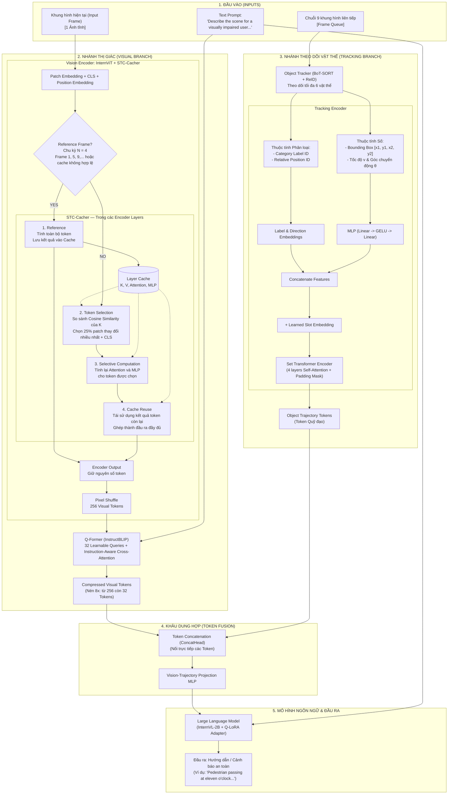


# NavVLM System Architecture

Dưới đây là sơ đồ tổng quan về kiến trúc và luồng xử lý dữ liệu của hệ thống **NavVLM**, tích hợp **STC-Cacher** nhằm tăng tốc Vision Encoder.

```mermaid
flowchart TB
    subgraph INPUTS["1. ĐẦU VÀO (INPUTS)"]
        Prompt["Text Prompt:<br/>'Describe the scene for a visually impaired user...'"]
        InFrame["Khung hình hiện tại (Input Frame)<br/>[1 Ảnh tĩnh]"]
        FrameSeq["Chuỗi 9 khung hình liên tiếp<br/>[Frame Queue]"]
    end

    subgraph VISUAL_BRANCH["2. NHÁNH THỊ GIÁC (VISUAL BRANCH)"]

        subgraph VE["Vision Encoder: InternViT + STC-Cacher"]

            STCInput["Patch Embedding + CLS + Position Embedding"]

            STCCheck{"Reference Frame?<br/>Chu kỳ N = 4<br/>Frame 1, 5, 9,... hoặc cache không hợp lệ"}

            subgraph CACHER["STC-Cacher — Trong các Encoder Layers"]

                Full["1. Reference<br/>Tính toàn bộ token<br/>Lưu kết quả vào Cache"]

                Cache[("Layer Cache<br/>K, V, Attention, MLP")]

                Select["2. Token Selection<br/>So sánh Cosine Similarity của K<br/>Chọn 25% patch thay đổi nhiều nhất + CLS"]

                Compute["3. Selective Computation<br/>Tính lại Attention và MLP<br/>cho token được chọn"]

                Reuse["4. Cache Reuse<br/>Tái sử dụng kết quả token còn lại<br/>Ghép thành đầu ra đầy đủ"]

                Full --> Cache
                Select --> Compute --> Reuse

                Cache -.-> Select
                Cache -.-> Compute
                Cache -.-> Reuse

            end

            STCOutput["Encoder Output<br/>Giữ nguyên số token"]

            STCFeatures["Pixel Shuffle<br/>256 Visual Tokens"]

            STCInput --> STCCheck

            STCCheck -->|YES| Full
            STCCheck -->|NO| Select

            Full --> STCOutput
            Reuse --> STCOutput

            STCOutput --> STCFeatures

        end

        QF["Q-Former (InstructBLIP)<br/>32 Learnable Queries + Instruction-Aware Cross-Attention"]

        VisTokens["Compressed Visual Tokens<br/>(Nén 8x: từ 256 còn 32 Tokens)"]

    end

    subgraph TRACKING_BRANCH["3. NHÁNH THEO DÕI VẬT THỂ (TRACKING BRANCH)"]
        BoTSORT["Object Tracker (BoT-SORT + ReID)<br/>Theo dõi tối đa 6 vật thể"]

        subgraph TRACKING_ENCODER["Tracking Encoder"]
            AttrsCategorical["Thuộc tính Phân loại:<br/>- Category Label ID<br/>- Relative Position ID"]
            AttrsNumeric["Thuộc tính Số:<br/>- Bounding Box [x1, y1, x2, y2]<br/>- Tốc độ v & Góc chuyển động θ"]
            LabelEmbed["Label & Direction Embeddings"]
            NumericMLP["MLP (Linear -> GELU -> Linear)"]
            Concatenate["Concatenate Features"]
            SlotEmbed["+ Learned Slot Embedding"]
            SetTrans["Set Transformer Encoder<br/>(4 layers Self-Attention + Padding Mask)"]
        end

        TrajTokens["Object Trajectory Tokens<br/>(Token Quỹ đạo)"]
    end

    subgraph FUSION_MODULE["4. KHÂU DUNG HỢP (TOKEN FUSION)"]
        ConcatHead["Token Concatenation (ConcatHead)<br/>(Nối trực tiếp các Token)"]
        ProjMLP["Vision-Trajectory Projection MLP"]
    end

    subgraph LLM_MODULE["5. MÔ HÌNH NGÔN NGỮ & ĐẦU RA"]
        LLM["Large Language Model<br/>(InternVL-2B + Q-LoRA Adapter)"]
        Answer["Đầu ra: Hướng dẫn / Cảnh báo an toàn<br/>(Ví dụ: 'Pedestrian passing at eleven o'clock...')"]
    end

    InFrame --> STCInput
    STCFeatures --> QF
    QF --> VisTokens

    FrameSeq --> BoTSORT
    BoTSORT --> AttrsCategorical & AttrsNumeric
    AttrsCategorical --> LabelEmbed
    AttrsNumeric --> NumericMLP
    LabelEmbed --> Concatenate
    NumericMLP --> Concatenate
    Concatenate --> SlotEmbed
    SlotEmbed --> SetTrans
    SetTrans --> TrajTokens

    VisTokens --> ConcatHead
    TrajTokens --> ConcatHead
    ConcatHead --> ProjMLP
    ProjMLP --> LLM

    Prompt --> QF
    Prompt --> LLM
    LLM --> Answer
```
